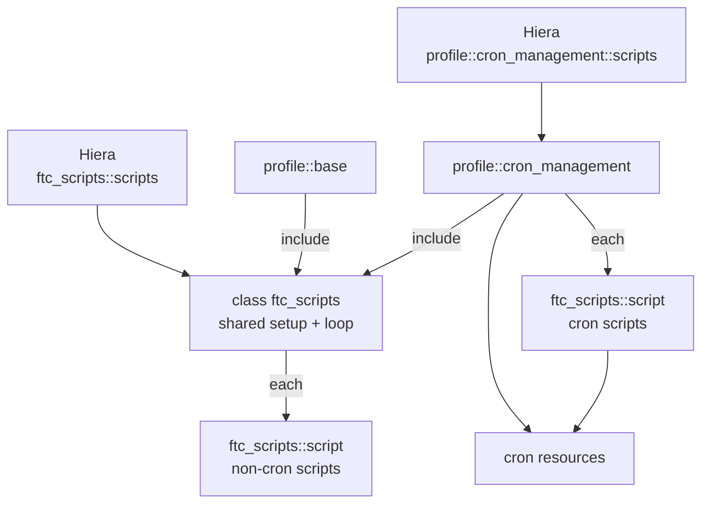

# Sharing ftc_scripts Between Cron and Base Profiles in Puppet

_Last updated: 2026-09-22_

## Overview

`profile::cron_management` currently declares `ftc_scripts` with resource-like syntax, so no other code can use the module on the same node. Including `ftc_scripts` from the base profile to push non-cron scripts fails with a duplicate declaration error.

The fix splits the module into two parts. The `ftc_scripts` class holds shared setup and deploys scripts listed under its own Hiera key. A new defined type, `ftc_scripts::script`, deploys one script and can be declared from anywhere.

After the change:

- `profile::base` runs `include ftc_scripts`, which pushes non-cron scripts listed in `ftc_scripts::scripts` in Hiera.
- `profile::cron_management` also runs `include ftc_scripts`, then declares `ftc_scripts::script` for each entry in its existing `profile::cron_management::scripts` Hiera data.
- Every script can target any pre-existing directory through its `dir` value; scripts without one go to `ftc_scripts::default_dir`. Puppet does not create or manage the directories.
- Both can coexist on one node, as long as no script title appears in both lists.

## Root cause

Puppet allows a class to be declared in two ways, and they behave differently when used more than once.

| Syntax | Example | Declared more than once? | Passes parameters? |
| --- | --- | --- | --- |
| Include-like | `include ftc_scripts`, `contain ftc_scripts`, `require ftc_scripts` | Yes, idempotent | No, parameters come from Hiera or defaults |
| Resource-like | `class { 'ftc_scripts': scripts => $scripts }` | No, only once per catalog | Yes, inline |

A resource-like declaration fails if the class is already in the catalog for any reason. That includes an earlier `include` from another profile. Evaluation order decides which one "wins", so the error can appear or disappear as manifests change.

In this setup, `profile::cron_management` uses resource-like syntax. Adding `include ftc_scripts` to `profile::base` puts the class in the catalog twice, which produces an error similar to:

```
Error: Evaluation Error: Duplicate declaration: Class[Ftc_scripts] is already declared
```

The general rule is: declare classes with `include` or `contain`, supply their parameters through Hiera, and use defined types for anything that needs to be declared multiple times with different values.

## Current setup

The cron profile reads a `$scripts` hash from Hiera and passes it straight into the class. The exact parameter names in your module may differ; the pattern is what matters.

```puppet
class profile::cron_management (
  Hash $scripts,
) {
  class { 'ftc_scripts':
    scripts => $scripts,   # resource-like: blocks every other use
  }

  # cron { ... } resources that call the deployed scripts
}
```

```yaml
profile::cron_management::scripts:
  job.sh:
    source: 'puppet:///modules/ftc_scripts/job.sh'
```

The planned addition that triggers the error:

```puppet
class profile::base {
  include ftc_scripts   # conflicts with the declaration above
}
```

## Target design

The class is included, never declared with parameters inline, and every individual script is a defined type instance with a unique title.



The base profile's scripts flow through the class; the cron profile's scripts go directly to the defined type.

| Component | Responsibility | Declared how |
| --- | --- | --- |
| `ftc_scripts` (class) | Holds the default target directory; deploys scripts listed in `ftc_scripts::scripts` | `include` only, from any number of places |
| `ftc_scripts::script` (defined type) | Deploys one script file into any existing directory | Once per script, unique title per node |
| `profile::base` | Pushes non-cron scripts | `include ftc_scripts` |
| `profile::cron_management` | Pushes cron scripts and manages cron entries | `include ftc_scripts` plus defined type per script |

## Implementation

Four files change. Paths assume a standard module and profile layout; adjust owner and mode defaults to match your environment. The `Stdlib::` types and `pick()` require puppetlabs-stdlib. All target directories are assumed to exist already; nothing here creates or manages them.

### 1. Defined type: `ftc_scripts/manifests/script.pp`

Deploys a single script into any directory. The resource title is the file name unless `filename` is set, which lets the same file go to two directories under different titles.

```puppet
define ftc_scripts::script (
  String                         $source,
  Optional[Stdlib::Absolutepath] $dir      = undef,
  String                         $filename = $title,
  String                         $owner    = 'root',
  String                         $group    = 'root',
  Stdlib::Filemode               $mode     = '0755',
  Enum['present', 'absent']      $ensure   = 'present',
) {
  include ftc_scripts   # provides $ftc_scripts::default_dir

  $target_dir  = pick($dir, $ftc_scripts::default_dir)
  $file_ensure = $ensure ? {
    'present' => 'file',
    default   => 'absent',
  }

  # The target directory must already exist on the node.
  file { "${target_dir}/${filename}":
    ensure => $file_ensure,
    owner  => $owner,
    group  => $group,
    mode   => $mode,
    source => $source,
  }
}
```

A `dir` can be any directory that already exists on the host, such as `/opt/ftc/cron` or `/usr/local/bin`. If it's missing, only that file resource fails on the agent; the rest of the catalog still applies.

### 2. Class: `ftc_scripts/manifests/init.pp`

Holds the default directory setting and deploys whatever is listed in its own Hiera key. It takes no consumer-specific parameters, so `include` is always safe.

```puppet
class ftc_scripts (
  Stdlib::Absolutepath $default_dir = '/opt/ftc/scripts',
  Hash                 $scripts     = {},
) {
  $scripts.each |String $name, Hash $params| {
    ftc_scripts::script { $name:
      * => $params,
    }
  }
}
```

`default_dir` is only a fallback path for scripts without `dir`; the class does not manage the directory itself.

### 3. Base profile: `profile/manifests/base.pp`

```puppet
class profile::base {
  include ftc_scripts
  # other base resources
}
```

### 4. Cron profile: `profile/manifests/cron_management.pp`

Keeps its existing `$scripts` Hiera data, but deploys each entry with the defined type instead of passing it to the class. Each entry can set its own `dir`.

```puppet
class profile::cron_management (
  Hash $scripts = {},
  Hash $jobs    = {},
) {
  include ftc_scripts

  $scripts.each |String $name, Hash $params| {
    ftc_scripts::script { $name:
      * => $params,
    }
  }

  # Works even when $scripts is empty
  $script_refs = $scripts.keys.map |$n| { Ftc_scripts::Script[$n] }

  $jobs.each |String $name, Hash $params| {
    cron { $name:
      *       => $params,
      require => $script_refs,
    }
  }
}
```

The `$jobs` hash is optional; keep your existing cron resources if they are defined another way. The `require` makes cron entries wait until their scripts are on disk.

## Hiera data

The cron profile's data stays under its current key. Non-cron scripts get a new key owned by the class. Each script picks its pre-existing target directory with `dir`.

```yaml
# ---- Non-cron: pushed by profile::base via include ftc_scripts ----
ftc_scripts::default_dir: '/opt/ftc/scripts'   # fallback when dir is omitted

ftc_scripts::scripts:
  cleanup.sh:                       # no dir: goes to default_dir
    source: 'puppet:///modules/ftc_scripts/cleanup.sh'
  report.sh:
    source: 'puppet:///modules/ftc_scripts/report.sh'
    dir: '/opt/ftc/reports'
  report.sh-tools:                  # same file, second directory
    filename: 'report.sh'
    source: 'puppet:///modules/ftc_scripts/report.sh'
    dir: '/opt/ftc/tools'
  healthcheck.sh:
    source: 'puppet:///modules/ftc_scripts/healthcheck.sh'
    dir: '/usr/local/bin'
    mode: '0750'

# ---- Cron: consumed by profile::cron_management ----
profile::cron_management::scripts:
  job.sh:
    source: 'puppet:///modules/ftc_scripts/job.sh'
    dir: '/opt/ftc/cron'
  rotate.sh:
    source: 'puppet:///modules/ftc_scripts/rotate.sh'
    dir: '/opt/ftc/cron/daily'

profile::cron_management::jobs:     # optional, if cron entries are data-driven
  ftc_job:
    command: '/opt/ftc/cron/job.sh'
    user: 'root'
    hour: 2
    minute: 0
```

Each hash key is the script's title and, unless `filename` is set, its file name. Values accept `source`, `dir`, `filename`, `owner`, `group`, `mode` and `ensure`; an unknown key fails compilation. Every `dir` must already exist on the nodes that receive the script.

### Merging across hierarchy levels

By default Hiera returns the first match only, so a node-level `ftc_scripts::scripts` hides the common-level one. To combine entries from several levels, add a merge rule in `common.yaml`:

```yaml
lookup_options:
  ftc_scripts::scripts:
    merge: deep
  profile::cron_management::scripts:
    merge: deep
```

With `deep`, a lower level can also override a single attribute of a script, such as `mode`, without repeating the whole entry.

## Rules and pitfalls

1. **Never declare `ftc_scripts` with `class { ... }` again.** One resource-like declaration anywhere reintroduces the original error. Use `include`, `contain` or `require`.
2. **A script title must be unique per node across both hashes.** If `job.sh` appears in `ftc_scripts::scripts` and in `profile::cron_management::scripts`, you get `Duplicate declaration: Ftc_scripts::Script[job.sh]`. A script needed by both uses belongs in one list only.
3. **The same file can go to several directories, but each copy needs its own title.** Use keys such as `report.sh` and `report.sh-tools`, with `filename: 'report.sh'` on the second.
4. **Target directories must pre-exist.** Nothing in this design creates them. A missing directory fails only that script's file resource on the agent.
5. **Don't manage the same file path from two places.** Two entries resolving to the same `dir` plus file name, or a `file` resource for that path in another module, collide even with different titles, because file paths are unique.
6. **Removing a script from Hiera does not delete it from nodes.** Set `ensure: absent` for a run before removing the entry.
7. **Use `contain` if ordering across profiles matters.** `contain ftc_scripts` in a profile makes the class sit inside that profile for `before`/`require` relationships.
8. **Don't work around duplicates with the `defined()` function or stdlib's `ensure_resource`.** This is not the same as a defined type (`define`), which this design relies on. A defined type is a reusable resource template, like `ftc_scripts::script`. The `defined()` function is a conditional check such as `if !defined(File['/path']) { ... }` that declares a resource only if nothing else has yet. It and `ensure_resource` hide duplicate errors, but the result depends on which manifest Puppet evaluates first, and differing attributes are silently ignored.

## Migration and testing

The change is safe to roll out in one step, because deployed script paths and contents stay the same.

1. Create a feature branch in your control repo (or r10k/Code Manager environment).
2. Add `ftc_scripts/manifests/script.pp` and update `ftc_scripts/manifests/init.pp` as shown above.
3. Update `profile::cron_management` to `include ftc_scripts` and loop over `$scripts` with the defined type. Remove the `class { 'ftc_scripts': ... }` block.
4. Add `include ftc_scripts` to `profile::base`.
5. Add `ftc_scripts::scripts` entries to Hiera for non-cron scripts, and a `dir` to any entry that shouldn't use `default_dir`. Check that no title appears on both sides and that every `dir` exists on the target nodes.
6. Validate syntax and style:

   ```bash
   puppet parser validate site/profile/manifests/*.pp modules/ftc_scripts/manifests/*.pp
   puppet-lint site/profile/manifests modules/ftc_scripts/manifests
   ```
7. Compile a catalog for a node that has both profiles, and one that has only base:

   ```bash
   puppet lookup --node <node> --explain ftc_scripts::scripts
   puppet lookup --node <node> --explain profile::cron_management::scripts
   puppet agent -t --noop --environment <branch>
   ```
8. In the noop output, confirm existing cron scripts are unchanged unless you moved them, and that new scripts show as `created` in the expected directories.
9. Merge the branch and run the agent on a canary node before the wider rollout.

For automated coverage, an rspec-puppet test that compiles `profile::base` together with `profile::cron_management` catches duplicate declarations before merge:

```ruby
describe 'profile::base' do
  let(:pre_condition) { 'include profile::cron_management' }
  it { is_expected.to compile.with_all_deps }
end
```

## Troubleshooting

| Error or symptom | Likely cause | Fix |
| --- | --- | --- |
| `Duplicate declaration: Class[Ftc_scripts] is already declared` | A resource-like `class { 'ftc_scripts': }` still exists somewhere | Search the control repo: `grep -rn "class { *'ftc_scripts'" .` and replace with `include` |
| `Duplicate declaration: Ftc_scripts::Script[<name>]` | The same script title is in both Hiera hashes, or declared manually as well | Keep the title in one list only; use `filename` for a second copy |
| `Duplicate declaration: File[<path>]` | Two entries resolve to the same directory and file name, or another module manages that path | Manage each path in one place only |
| `Could not set 'file' on ensure: No such file or directory` | The target `dir` doesn't exist on that node | Create the directory outside this module, or correct the `dir` value |
| `has no parameter named '<key>'` | A Hiera entry has a key the defined type doesn't accept | Fix the key, or add the parameter to `ftc_scripts::script` |
| Scripts missing on some nodes | Hiera returns only the first match | Add `merge: deep` in `lookup_options`, then check with `puppet lookup --explain` |
| Cron job runs before its script exists on first run | No ordering between `cron` and the script | Add `require => Ftc_scripts::Script['<name>']` to the cron resource |
| Old script still on disk after removing it from Hiera | Puppet stops managing, but doesn't delete | Set `ensure: absent` for one run, then remove the entry |
